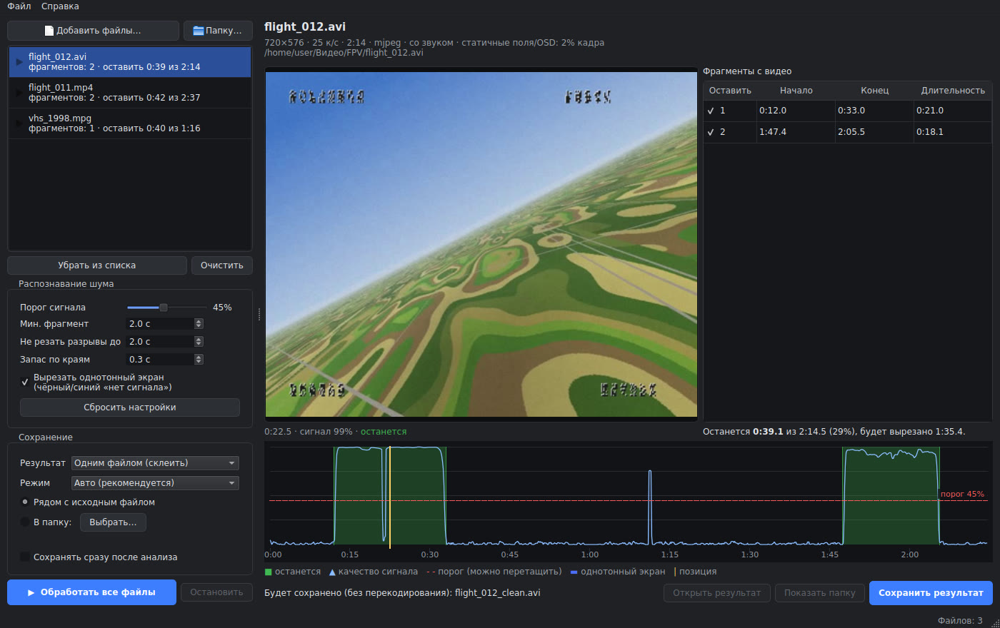
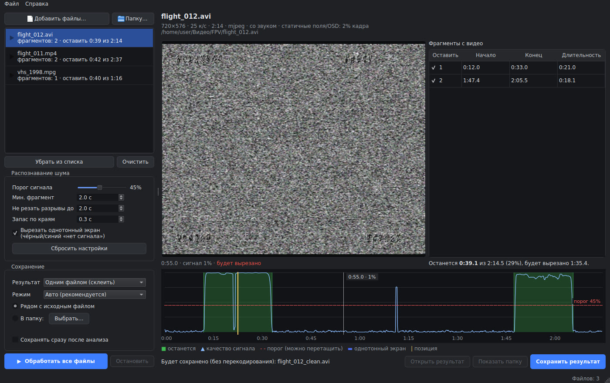

# AV Video Clipper

Программа сама находит в видеозаписи участки с белым шумом («снегом»), вырезает их
и оставляет только настоящее видео.

Для чего она нужна: запись с аналогового AV-входа идёт непрерывно, а сигнал есть не всегда.
Так бывает с FPV-видеорегистратором или AV-приёмником, с захватом через USB-карту, с оцифровкой VHS.
В итоге в файле несколько кусков видео, а всё остальное время на экране «снег».
Программа оставит от такого файла только эти куски.



Зелёным на шкале отмечено то, что останется. Голубая линия — «качество сигнала» каждого кадра,
красная пунктирная — порог. При наведении курсора на шкалу показывается кадр из этого места:



## Возможности

- **Всё автоматически.** Добавили файлы, программа нашла видео, нажали «Сохранить».
  Можно включить сохранение сразу после анализа и вообще ничего не нажимать.
- **Надёжное распознавание.** Работает при сильном сжатии записи (MJPEG, H.264, MPEG-4, MPEG-2),
  чёрных полях по краям кадра, надписях OSD приёмника или регистратора, дублированных кадрах,
  быстром движении камеры, тёмных сценах и частично «зашумлённой» картинке при слабом сигнале.
- **Наглядная проверка.** Шкала сигнала с предпросмотром кадра под курсором. Порог можно двигать мышью.
- **Ручная правка.** Можно отключить лишний фрагмент галочкой или поправить время начала и конца.
- **Без потери качества.** Записи MJPEG/DV (типичные для AV-захвата) режутся без перекодирования и
  точно по кадрам. Остальные форматы перекодируются в H.264 (MP4) в высоком качестве (CRF 18).
- **Результат одним файлом или частями.** Фрагменты можно склеить в один файл или сохранить по отдельности.
- **Пакетная обработка.** Можно добавить сразу много файлов или целую папку (например, с карты регистратора).
- **Консольный режим** для скриптов и автоматизации.

## Установка

### Windows: готовая программа

Устанавливать ничего не нужно, ffmpeg уже внутри.

1. Откройте вкладку [Actions](../../actions) этого репозитория и выберите последнюю успешную сборку
   (зелёная галочка). Внизу, в разделе **Artifacts**, скачайте **AVvideoClipper-windows**.
   Если в репозитории есть [Releases](../../releases), там лежит тот же архив.
2. Распакуйте архив в любую папку.
3. Запустите `AVvideoClipper.exe`.

Если Windows SmartScreen предупредит о неизвестном издателе, нажмите «Подробнее» → «Выполнить в любом случае».

### Из исходников (Windows, Linux, macOS)

Нужен [Python](https://www.python.org/downloads/) 3.10 или новее.

- **Windows:** дважды щёлкните `run.bat`. При первом запуске он сам установит зависимости
  (понадобится интернет, это пара минут).
- **Linux / macOS:** запустите `./run.sh`.

Или вручную:

```bash
pip install -r requirements.txt
python -m avclipper
```

ffmpeg скачивается автоматически вместе с пакетом `imageio-ffmpeg`. Если в системе уже есть
ffmpeg (в `PATH`), используется он. Путь к нужному ffmpeg можно задать переменной окружения
`AVCLIPPER_FFMPEG`.

## Как пользоваться

1. **Перетащите видеофайлы в окно** или нажмите «Добавить файлы…» / «Папку…». Анализ начнётся сам,
   прогресс виден в списке слева.
2. **Проверьте результат.** В таблице перечислены найденные фрагменты, на шкале они выделены зелёным.
   Наведите курсор на шкалу, чтобы увидеть кадр. Щелчок ставит позицию, стрелки ←/→ сдвигают её
   на 1 с (с Shift на 0,1 с). Колесо мыши меняет масштаб шкалы, двойной щелчок сбрасывает его.
3. **Поправьте, если нужно.** Перетащите красную линию порога, снимите галочку с лишнего фрагмента
   или дважды щёлкните по времени в таблице и введите своё (например, `1:23.4`).
4. **Нажмите «Сохранить результат»** или «Обработать все файлы». Рядом с исходным файлом появится
   `имя_clean.mp4` (или `.avi` и т. п., если перекодирование не понадобилось). Исходный файл не изменяется.
   Если файл с таким именем уже есть, он не перезаписывается: к имени добавляется номер.

## Настройки

| Настройка | По умолчанию | Что делает |
|---|---|---|
| Порог сигнала | 45% | Кадры с оценкой выше порога считаются видео. Ниже порог — больше «шумного» видео останется, выше — режет строже. |
| Мин. фрагмент | 2 с | Более короткие вспышки изображения среди шума отбрасываются. |
| Не резать разрывы до | 2 с | Если посреди видео сигнал пропал ненадолго, этот кусок шума остаётся и видео не распадается на части. |
| Запас по краям | 0,3 с | Сколько секунд добавить до и после каждого фрагмента. |
| Вырезать однотонный экран | вкл. | Чёрный или синий экран «нет сигнала» тоже считается шумом. |
| Результат | одним файлом | Склеить фрагменты в один файл или сохранить каждый отдельно (`имя_clean_01`, `_02`, …). |
| Режим | Авто | **Авто:** MJPEG/DV и другие «покадровые» форматы без перекодирования, остальное в H.264. **Точно:** всегда перекодировать, границы точны до кадра. **Быстро:** без перекодирования, но у H.264/MPEG границы сдвигаются к ближайшим ключевым кадрам. |
| Папка | рядом с исходным | Куда сохранять результаты. |

Настройки запоминаются между запусками.

## Как это работает

ffmpeg декодирует запись и уменьшает каждый кадр до крошечного чёрно-белого изображения.
Главный признак — насколько кадр похож на предыдущий. Сравнение идёт в очень грубом масштабе
(40×30 точек), где мелкое зерно усредняется:

- **«снег» случаен**, поэтому два соседних кадра шума совсем не похожи друг на друга (корреляция около 0);
- **настоящее изображение** меняется от кадра к кадру плавно (0,7–1,0), даже при быстром полёте,
  плохом приёме, сильном сжатии или в темноте.

Части кадра, которые не меняются никогда (чёрные поля карты захвата, пиллербокс 4:3 в кадре 16:9,
надписи OSD), тоже выглядели бы «похожими» и мешали бы. Программа находит такие пиксели и не
учитывает их. Дублированные кадры (например, запись 25 к/с в файле на 30 или 50 к/с) пропускаются.

Дальше оценка сглаживается по времени и сравнивается с порогом. Короткие разрывы внутри видео
склеиваются, короткие вспышки среди шума отбрасываются, по краям добавляется запас.

На подготовленных тестовых записях (реальное видео, аналоговый «снег», OSD, переходы при потере
сигнала, сжатие MJPEG / H.264 / MPEG-4 / MPEG-2 с разным битрейтом, чёрные поля, дубли кадров)
границы находятся с точностью около 0,1–0,3 с. Анализ идёт в 4–50 раз быстрее реального времени,
в зависимости от формата и битрейта записи.

## Консольный режим

```bash
python -m avclipper --cli запись.avi                     # найти видео и сохранить запись_clean.avi
python -m avclipper --cli *.mp4 -o D:/Готово --separate  # каждый фрагмент отдельным файлом
python -m avclipper --cli запись.mp4 --dry-run --json    # только показать найденные фрагменты
python -m avclipper --cli --help                         # все параметры
```

Параметры совпадают с настройками окна: `--threshold 0.45`, `--min-segment 2`, `--merge-gap 2`,
`--pad 0.3`, `--keep-blank`, `--mode auto|reencode|copy`, `--crf 18`.

Проверить, что всё работает (создаёт тестовую запись, ищет в ней видео и сохраняет результат):

```bash
python -m avclipper --self-test
```

## Если результат не устраивает

- **Вырезано лишнее видео** (например, очень тёмные или сильно зашумлённые места): понизьте порог
  или увеличьте «Не резать разрывы до».
- **Остался шум:** повысьте порог. Если шум остался по краям фрагментов, уменьшите «Запас по краям».
- **Мелькают короткие куски шума или видео:** увеличьте «Мин. фрагмент».
- **Границы неточные в режиме «Быстро»:** выберите «Точно».
- **«Не найден ffmpeg»:** установите зависимости (`pip install -r requirements.txt`) или укажите путь
  к ffmpeg в переменной `AVCLIPPER_FFMPEG`.

## Для разработчиков

```
avclipper/
  analysis.py    покадровая оценка сигнала (ffmpeg → numpy)
  segments.py    поиск фрагментов по оценкам
  export.py      нарезка и склейка через ffmpeg
  media.py       поиск ffmpeg, чтение параметров файла, запуск процессов
  cli.py         консольный режим
  selftest.py    самопроверка
  gui/           интерфейс на PySide6 (Qt)
tests/           тесты (pytest), генерируют синтетические записи через ffmpeg
packaging/       сборка Windows-программы (PyInstaller)
```

Тесты: `pip install pytest && python -m pytest`. Тесты окна запускаются без экрана
(`QT_QPA_PLATFORM=offscreen`, на Linux нужны пакеты `libegl1 libgl1 libxkbcommon0`).

Сборка `AVvideoClipper.exe` под Windows (так же её делает GitHub Actions, см. `.github/workflows/build.yml`):

```bat
pip install -r requirements.txt pyinstaller
python packaging/fetch_ffmpeg.py
pyinstaller packaging/avclipper.spec --noconfirm
```

Готовая программа окажется в `dist/AVvideoClipper/`. Чтобы сборка попала в Releases, создайте тег
вида `v1.0.0`.

Программа Windows включает ffmpeg (лицензия GPL) из пакета
[imageio-ffmpeg](https://github.com/imageio/imageio-ffmpeg). Исходный код ffmpeg: <https://ffmpeg.org/download.html>.
